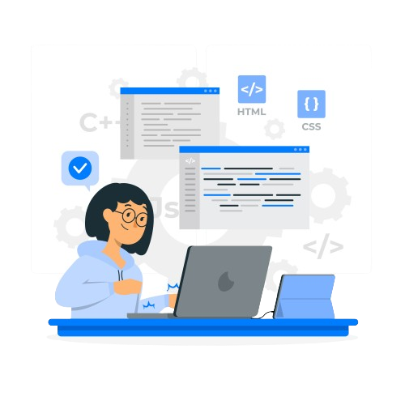

<h1 align="center">I'm sejal Sharma </h1>
<h3 align="center">A passionate frontend developer from India</h3>

- 🌱 I’m currently learning **Fullstack Development**

- 💬 Ask me about **HTML , CSS , Python , C And C++**

- 📫 How to reach me **sejalsharmaany@gmail.com**

<h3 align="left">Languages and Tools:</h3>

 

 
 

---

    

